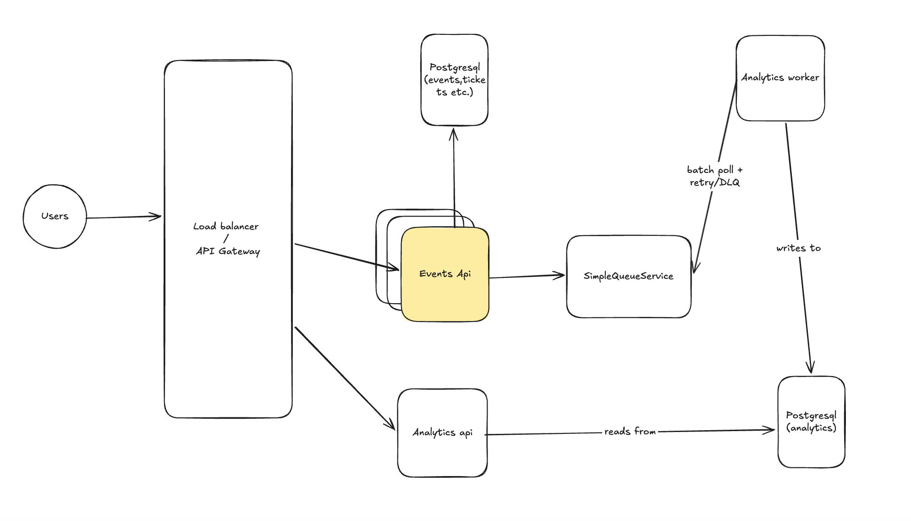

# Cloud-Native Event Platform (NestJS + AWS SQS + ECS + Terraform + Next.js)

## Architecture



## Services
- `apps/event-service` (NestJS HTTP) — events + ticket types
- `apps/analytics-api` (NestJS HTTP) — dashboard read APIs (Redis cached)
- `apps/analytics-worker` (NestJS worker) — SQS consumer (batch + idempotent aggregation)
- `apps/web` (Next.js) — dashboard UI
- `tools/seed` — `npm run seed` publishes `TicketSold` messages to SQS

## Data flow
1. `npm run seed` generates representative `TicketSold` messages and publishes to SQS.
2. `analytics-worker` batches messages, filters by idempotency, and applies additive UPSERTs to `analytics_db`.
3. `analytics-api` serves dashboard queries from `analytics_db`, with Redis caching.
4. `web` calls `event-service` (event list) and `analytics-api` (dashboard metrics).

## Local run (Docker Compose)
Prereqs: Docker

```bash
cd docker
docker compose up --build
```

Create sample event + ticket types:

```bash
curl -X POST http://localhost:3001/events \
  -H 'content-type: application/json' \
  -d '{
    "name":"Concert A",
    "location":"Berlin",
    "total_capacity":1000,
    "sales_channels":["online","box_office","partners"]
  }'
```

Copy `id` from response, then:

```bash
curl -X POST http://localhost:3001/events/<EVENT_ID>/ticket-types \
  -H 'content-type: application/json' \
  -d '{ "name":"Floor", "kind":"FULL", "price_cents":15000, "capacity":700 }'

curl -X POST http://localhost:3001/events/<EVENT_ID>/ticket-types \
  -H 'content-type: application/json' \
  -d '{ "name":"Seats", "kind":"HALF", "price_cents":9000, "capacity":300 }'
```

Run seed:
```bash
cd tools/seed
npm run seed
```
To remove: 
npm run seed:delete

Open:
- Event API: http://localhost:3001
- Analytics API: http://localhost:3002
- Web: http://localhost:3000/dashboard

## Idempotency + batching (analytics-worker)
- `processed_sales(sale_id)` prevents double counting (at-least-once delivery safe).
- Worker folds a batch into per-event and per-(event,channel) deltas, then applies additive UPSERTs.

## AWS (Terraform)
`infra/` contains placeholders for:
- VPC, ECS Fargate services, internal ALB
- API Gateway HTTP API + VPC Link to ALB
- SQS + DLQ redrive policy
- RDS Postgres per service
- ElastiCache Redis
- CloudWatch logs/alarms

## Notes / TODOs
- Add autoscaling policies (ALB RequestCountPerTarget)
- Add WAF and auth (optional)
- Monitoring solutions such as New Relic and gathering metrics / telemetry
- Consider transactional outbox or Change Data Capture pattern to ensure consistency on published events if needed
